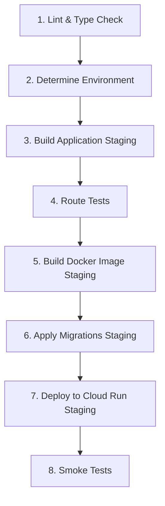

# CI/CD Workflow - Correct Job Order

**Date**: 2025-10-16
**Status**: ✅ Fixed - Migrations Now Run After Docker Build

---

## Problem Identified

The original workflow had migrations running **before** Docker build, which was incorrect:

```
❌ OLD ORDER (Incorrect):
1. Build & Test
2. Apply Migrations ← Too early!
3. Build Docker Image
4. Deploy
```

**Why this was wrong:**
- Migrations were being applied during the build phase
- If Docker build failed, migrations would already be applied
- Migrations should run against the target environment right before deployment
- No rollback possible if deployment fails

---

## Solution Implemented

**✅ NEW ORDER (Correct):**

```
1. Lint & Type Check
2. Determine Environment (staging vs production)
3. Build Application
4. Route Tests
5. Build Docker Image ← Build the deployment artifact first
6. Apply Migrations ← Apply to database right before deployment
7. Deploy to Cloud Run ← Deploy the new version
8. Smoke Tests
```

---

## Detailed Workflow

### Staging Pipeline (develop branch)



**Job Sequence:**
1. **Job 1**: Lint & Type Check
2. **Job 2**: Determine Environment (`is-staging = true`)
3. **Job 3**: Build Application (Staging)
   - Creates `.env.production` with staging secrets
   - Runs `npm run build`
   - Uploads build artifacts
4. **Job 5**: Route Tests
   - Starts local Supabase
   - Runs 42+ route tests
5. **Job 6**: Build & Push Docker Image (Staging)
   - Builds Docker image with staging environment vars
   - Pushes to GCR: `gcr.io/PROJECT/cfb-website:staging-SHA`
6. **Job 7**: Apply Migrations (Staging) ✨ **NEW POSITION**
   - Links to staging Supabase project
   - Runs `supabase db push --linked`
   - Applies all pending migrations
7. **Job 10**: Deploy to Cloud Run (Staging)
   - Deploys the Docker image to `cfb-website-staging`
   - Sets environment variables and secrets
8. **Job 10**: Smoke Tests
   - Verifies deployment is accessible

### Production Pipeline (main branch)

Identical sequence, but:
- Uses production secrets/variables
- Deploys to `cfb-website` (production service)
- No `-staging` suffix on Docker tags

---

## Key Benefits

### 1. Safety First
- ✅ Docker image is built and validated before any database changes
- ✅ If Docker build fails, database remains unchanged
- ✅ Migrations only run if all tests pass

### 2. Atomic Deployment
- ✅ Migrations run immediately before deployment
- ✅ Database and code are updated together
- ✅ Minimal time window for inconsistency

### 3. Rollback Capability
- ✅ If migrations fail, deployment is blocked
- ✅ If deployment fails, migrations have been applied but deployment hasn't changed
- ✅ Can rollback Cloud Run deployment if needed

### 4. Clear Failure Points
```
Build fails → No Docker image → No migrations → No deployment
Tests fail → No Docker image → No migrations → No deployment
Docker build fails → No migrations → No deployment
Migrations fail → No deployment ← CRITICAL SAFETY
Deployment fails → Database updated, can rollback deployment
```

---

## Migration Safety Features

### Pre-Migration Checks
1. ✅ Lint & type check passed
2. ✅ Application builds successfully
3. ✅ All route tests passed
4. ✅ Docker image built and pushed successfully

### During Migration
1. ✅ Links to correct Supabase project (staging or production)
2. ✅ Uses `SUPABASE_DB_PASSWORD` for authentication
3. ✅ Runs `supabase db push --linked` (applies only new migrations)
4. ✅ Verifies migrations with `supabase migration list --linked`

### Post-Migration
1. ✅ Deployment only proceeds if migrations succeed
2. ✅ New code deployed immediately after schema updates
3. ✅ Smoke tests verify the deployed application works

---

## Job Dependencies

### Staging
```yaml
docker-build-staging:
  needs: [determine-environment, build-staging, test-routes]

migrate-staging:
  needs: [determine-environment, docker-build-staging]  # ← After Docker build

deploy-staging:
  needs: [determine-environment, migrate-staging]  # ← After migrations
```

### Production
```yaml
docker-build-production:
  needs: [determine-environment, build-production, test-routes]

migrate-production:
  needs: [determine-environment, docker-build-production]  # ← After Docker build

deploy-production:
  needs: [determine-environment, migrate-production]  # ← After migrations
```

---

## Required Secrets

### For Build & Docker
- `SUPABASE_URL` (variable) or `secrets.SUPABASE_URL`
- `SUPABASE_ANON_KEY` (secret)
- `SUPABASE_SERVICE_ROLE_KEY` (secret)
- `GOOGLE_PLACES_API_KEY` (secret)
- `GOOGLE_PLACE_ID` (secret)
- `GOOGLE_PROJECT_ID` (secret)
- `GCP_SA_KEY` (secret)

### For Migrations (NEW)
- `SUPABASE_DB_PASSWORD` (secret) ← **Required for migrations**

---

## Example Workflow Run

### Successful Deployment
```
✅ Lint & Type Check (35s)
✅ Determine Environment (2s) → is-staging = true
✅ Build Application (Staging) (1m6s)
✅ Route Tests (4m24s)
✅ Build Docker Image (Staging) (2m15s)
✅ Apply Migrations (Staging) (15s) ← Applied all 30 migrations
✅ Deploy to Cloud Run (Staging) (45s)
✅ Smoke Tests (10s)

Total: ~9 minutes
```

### Failed Docker Build (Safe)
```
✅ Lint & Type Check
✅ Determine Environment
✅ Build Application
✅ Route Tests
❌ Build Docker Image ← Failed here
⏭️ Apply Migrations ← Skipped (no database changes)
⏭️ Deploy ← Skipped
⏭️ Smoke Tests ← Skipped

Database: Unchanged ✅
Deployment: Unchanged ✅
```

### Failed Migrations (Safe)
```
✅ Lint & Type Check
✅ Determine Environment
✅ Build Application
✅ Route Tests
✅ Build Docker Image ← Image is ready
❌ Apply Migrations ← Failed here
⏭️ Deploy ← Skipped (deployment blocked)
⏭️ Smoke Tests ← Skipped

Docker Image: Built (ready to retry) ✅
Database: May be partially updated (depends on migration)
Deployment: Unchanged ✅
```

---

## Migration Best Practices

### 1. Write Idempotent Migrations
```sql
-- ✅ Good: Can run multiple times
CREATE TABLE IF NOT EXISTS users (
  id uuid PRIMARY KEY DEFAULT gen_random_uuid()
);

-- ❌ Bad: Fails on second run
CREATE TABLE users (
  id uuid PRIMARY KEY
);
```

### 2. Test Migrations Locally
```bash
# Start local Supabase
npx supabase start

# Create migration
npx supabase db diff -f add_new_feature

# Test it
npx supabase db reset
npm run dev

# Commit
git add supabase/migrations/
git commit -m "feat: Add new feature"
git push origin develop
```

### 3. Verify in Staging First
1. Push to `develop` branch
2. Watch GitHub Actions
3. Check staging database: `SELECT * FROM supabase_migrations.schema_migrations`
4. Test staging site thoroughly
5. Only then merge to `main` for production

---

## Rollback Procedures

### If Deployment Fails After Migrations
```bash
# Option 1: Rollback Cloud Run deployment
gcloud run services update-traffic cfb-website-staging \
  --to-revisions=PREVIOUS_REVISION=100

# Option 2: Redeploy previous version
gcloud run deploy cfb-website-staging \
  --image=gcr.io/PROJECT/cfb-website:staging-PREVIOUS_SHA
```

### If Migrations Fail
1. Fix the migration SQL locally
2. Create a new migration file
3. Test locally with `supabase db reset`
4. Commit and push to trigger new deployment

### If Data Corruption
1. Restore from Supabase backup (automatic daily backups)
2. Apply corrective migration
3. Redeploy application

---

## Monitoring

### Check Migration Status
```sql
-- In Supabase SQL Editor
SELECT
  version,
  name,
  executed_at
FROM supabase_migrations.schema_migrations
ORDER BY version DESC
LIMIT 10;
```

### View GitHub Actions Logs
```bash
# Latest run
gh run view --branch develop --log

# Specific job logs
gh run view RUN_ID --log-failed
```

### Verify Deployment
```bash
# Check staging
curl https://cfb-website-staging-clinica-ferreira-borges.run.app

# Check production
curl https://clinicaferreiraborges.pt
```

---

## Comparison: Old vs New

| Aspect | Old Order | New Order |
|--------|-----------|-----------|
| Migrations timing | Before Docker build | After Docker build |
| Docker build fails | Migrations already applied ❌ | No migrations applied ✅ |
| Migrations fail | Docker not built yet ❌ | Docker ready to deploy ✅ |
| Deployment fails | Inconsistent state ❌ | Can rollback deployment ✅ |
| Safety | Medium | High ✅ |
| Rollback | Difficult | Easy ✅ |

---

## Next Steps

1. ✅ **Workflow order fixed**
2. ⏳ **Add `SUPABASE_DB_PASSWORD` secret** to Staging environment
3. ⏳ **Test staging deployment**
4. ⏳ **Verify migrations applied successfully**
5. ⏳ **Configure Production environment**

---

**Last Updated**: 2025-10-16
**Workflow Version**: v2.0 (Migration-after-Docker)
